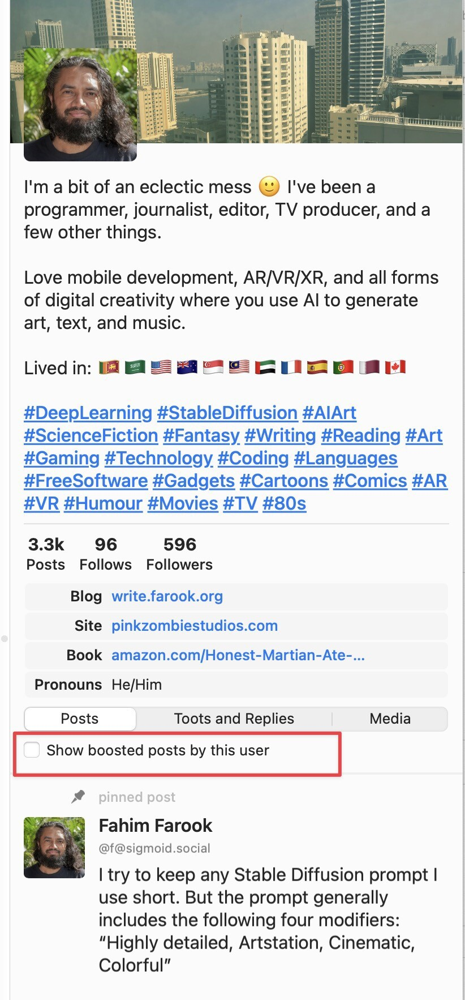

# Mastonaut Modified

This is a fairly extensively modified version of Mastonaut forked (originally) from https://github.com/chucker/Mastonaut

Since this codebase has made some heavy changes to the code and project structure, it's not feasible to create PRs to merge these changes back upstream. Plus, I tend to make some very strong decisons regarding code-styling, formatting, and package management and that might not sit well with others 🙂

That said, I believe this codebase is easier to build and run than the original one, though YMMV. If you want to build and run on your own, you can look at the **Build** section further down for all the details.

**Binary Builds**

Someone asked for a binary build and so I've created a binary. It should be accessible from [here](https://github.com/FahimF/Mastonaut/releases). Do note that I might not be releasing binaries on a regular schedule, but I'll add new binaries as and when I have the time and when enough features have accumulated to warrante a new build 🙂 (There are a lot of features/fixes I want to add, but the trouble is finding the time to work on this ...)

## What's new

Here are some changes from the original Mastonaut. There might be other changes and minor fixes, but these are the things that I do remember at the moment. (I might update this section as I add more features, or I might forget to 😛)

### 1.0 (November 2022)

* Displaying favourites and bookmarks timelines.
* Ability to bookmark items from a post/status (the ability to favourite was already there but no favourites timeline was present.)
* Display counts for replies, boosts, and favourites.
* Ability to open more than one instance of the same timeline (for example to compare a Homeline from the previous night to find the spot where you left off so that you can scroll back 🙂)
* Set the main Mastodon window to not close when you tap the close button. Otherwise, when you click on the icon in the dock, a new instance opens and you lose your original place on the timeline.
* Changed the open new timeline menu to always remain the same without changing the order of items.
* Fixed several issues with the post composer where it would get the character count wrong, wouldn't warn you when you exceeded the character count etc. all surrounding URLs in the post.
* Changed all references to "toots" to say "post" instead 😛
* Changed the connection status indicator to show even in production builds and added a tooltip to it so that you know what's wrong when there's an error by hovering over the status indicator.
* Show a badge count for new home timeline entries when the app is closed/minimized. (The count might be off if you have two home timelines open at the same time.)
* Log to a file with log rotation so that debugging is made easier (this feature if not fully in place.)

### 1.2 (January 2023)

* Ability to filter posts in a profile to remove boosts and to only show posts by the user.
* Show filter phrase / reason for filtered post markers
* Show the actual action date (rather than the original post date) for notifications such as boosts and favourites.
* Ability to zoom images in posts and profile.
* Ability to change text size in posts so that you can make the text larger or smaller to suit your preference.
* A global reload button to reload all visible columns.
* Better handling of URLs for counting characters when creating a post.

## What's changed in the project

* Removed CocoaPods dependency. The project used three third-party libraries and two of them are now integrated in as Swift Package Manager (SPM) packages.
* The third package, MastodonKit, has been integrated in as source since I've been adding to MastodonKit to support new features and functionality that it didn't support. It would have been better to have kept MastodonKit separate and pushed the changes upstream, but this is how things worked out since I was trying to get everything working quickly so that I had a working Mastodon client.
* I have stripped out most of the localization strings since there was no localization except for the possiblity of support in the future. I find the literal strings annoying for some reason 😛
* I switch graphics used over to SF Symbols as much as possible so that separate graphic assets don't need to be used/included. These changes are ongoing but the old graphic assets have not been removed from the project.
* Removed app sandboxing.
* I've tried to eliminate as many compiler warnings as posisble and update the code where possible to the latest approaches but this again is ongoing and happens as/when I come across stuff.

## Build

The following instructions assume Xcode 14.1 on macOS 12.6.

### Setup

The code used to make user of an XCConfig file to configure the project but it interfered with getting code-signing working for the 1.2 release and I didn't have time to look into the issue to figure out what was going on. So I've opted for manual code-signing in the project but this means that you'll need to figure out the various places the changes have to be made in order to make the code work. Sorry about that, but I will try to add some documentation for that here at some poing.

### Bundle IDs

The bundle ID _base_ is used because Mastonaut consists of multiple projects, which use an app group to share information. Given a `MASTONAUT_BUNDLE_ID_BASE` of `com.example.mastonaut` and a `DEVELOPMENT_TEAM` of `ABCDEFGH`:

- the main app will be `com.example.mastonaut.mac`
- the macOS Sharing extension will be `com.example.mastonaut.mac.QuickToot`
- the Core Data database shared by the two above will be stored in `~/Library/Group Containers/ABCDEFGH.com.example.mastonaut/Mastonaut/Mastonaut.sqlite`
- Keychain credentials will be prefixed `ABCDEFGH.com.example.mastonaut.keychain`

### Pitfalls

- The `.xcconfig` will auto-append `.mac` and other suffixes to the `MASTONAUT_BUNDLE_ID_BASE`, so you should pick something like
`com.example.mastonaut` (replacing `com.example` with whatever reverse domain name you have set up for your account).

- If you don't know your Team ID, go into _Signing & Capabilities_ in your project and select your team, then your UI will show it under 'App Groups'.
Then revert the project file so it will use the setting from the `xcconfig` and you don't have a lurking change in your checkout.

- If you're using a personal developer ID and get an error like `Personal development teams, including "Your Name Here", do not support the Push
Notifications capability.`, you may have to go _Signing and Capabilities_ and delete the "Push Notifications" capability by clicking the little
trash can next to it. **Do not check in this change.**
